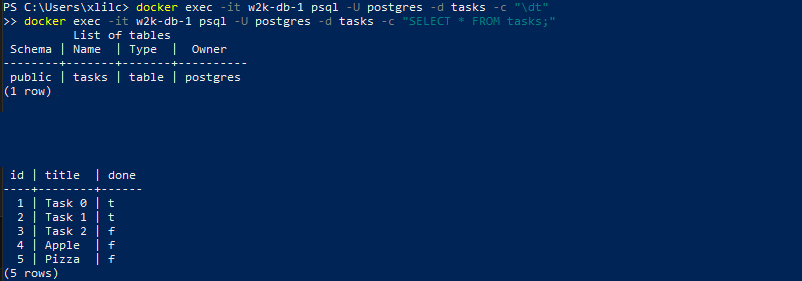

```text
 ______ _      ______            _       ___  _____
|  ___| |     | ___ \          | |     / _ \|_   _|
| |_  | |_   _| |_/ /__ _ _ __ | | __ / /_\ \ | |
|  _| | | | | |    // _` | '_ \| |/ / |  _  | | |
| |   | | |_| | |\ \ (_| | | | |   <  | | | |_| |_
\_|   |_|\__,_|_\ \__,_|_| |_|_|\_\ \_| |_/\___/
          __/ |
         |___/
```

```markdown
# Task API — PostgreSQL + Docker

A CRUD REST API built with **FastAPI**, running against a **PostgreSQL** database inside Docker. The entire stack — API and database — starts with a single command.

FlyRankAI Backend Internship Assignment.

---

## Quick Start

```bash
git clone https://github.com/najtms/task-database-api-postgres-docker.git
cd task-database-api-postgres-docker
cp .env.example .env
docker compose up
```

The API will be available at `http://localhost:8000`, with interactive docs at `http://localhost:8000/docs`.

On first run, the `tasks` table is created automatically and seeded with three example tasks.

---

## Environment Variables

Copy `.env.example` to `.env` and adjust if needed:

```
DATABASE_URL=postgresql://postgres:dev@db:5432/tasks
```
---

## Tech Stack

* Python 3.11
* FastAPI + Uvicorn
* PostgreSQL 18 (Docker)
* psycopg
* Docker Compose

---

## API Endpoints

| Method | Endpoint      | Description     |
| ------ | ------------- | --------------- |
| GET    | `/`           | API information |
| GET    | `/health`     | Health check    |
| GET    | `/tasks`      | Get all tasks   |
| GET    | `/tasks/{id}` | Get task by ID  |
| POST   | `/tasks`      | Create task     |
| PUT    | `/tasks/{id}` | Update task     |
| DELETE | `/tasks/{id}` | Delete task     |

---

## Example curl

```bash
curl -i http://localhost:8000/tasks
```

```http
HTTP/1.1 200 OK
content-type: application/json

[
  {"id":1,"title":"Task 0","done":true},
  {"id":2,"title":"Task 1","done":true},
  {"id":3,"title":"Task 2","done":false}
]
```

---

## Database



Verified via:
```bash
docker exec -it w2k-db-1 psql -U postgres -d tasks -c "\dt"
docker exec -it w2k-db-1 psql -U postgres -d tasks -c "SELECT * FROM tasks;"
```

---

## Project Structure

```
.
├── main.py
├── Dockerfile
├── compose.yaml
├── requirements.txt
├── .env.example
├── .gitignore
├── README.md
└── images/
    └── db-screenshot.png
```

---

## Author

**Muhamad Assaad**
FlyRank Backend Internship Assignment
```